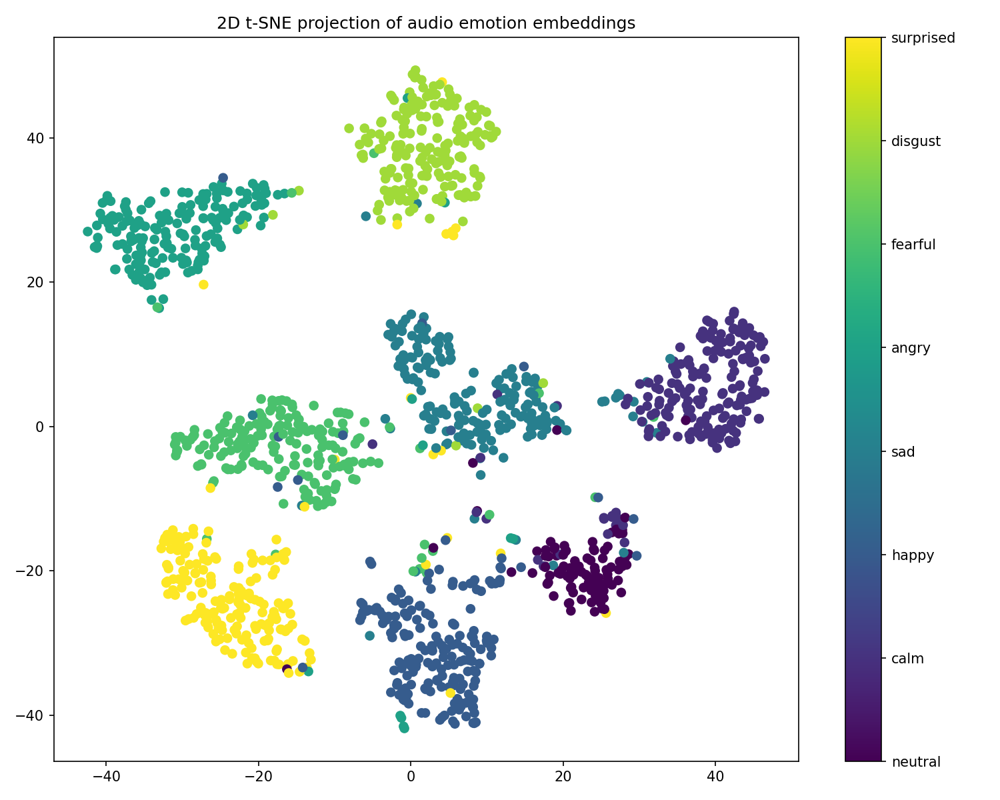

# AudioVec

A 256-dimensional audio emotion embedding model trained on the RAVDESS dataset. Given a speech audio file, the model extracts a compact vector representation that captures the emotional content of the voice, and classifies it into one of eight emotions.

---

## Pipeline Overview

```
Raw Audio (.wav, .mp3, etc.)
       |
       v
Mel-Spectrogram (128 x 228 x 1)
       |
       v
3× Conv Blocks (CNN feature extractor)
       |
       v
BiGRU (temporal modelling over time frames)
       |
       v
Mean-pool over time → 256-d Embedding Vector
       |
       +---> Emotion Classification (8 classes)
```

### 1. Mel-Spectrogram Extraction

Raw audio is a one-dimensional waveform. To make it processable by a neural network, it is converted into a mel-spectrogram -- a 2D visual representation of frequency content over time, scaled to human hearing perception.

- Audio is loaded at 22,050 Hz sample rate
- A mel-spectrogram with 128 frequency bands (max 8 kHz) is computed
- The spectrogram is trimmed or padded to 228 time frames (~5.3 seconds)
- A channel dimension is added, producing a (128, 228, 1) input tensor
- Values are normalized to `[0, 1]` range via dB scaling

### 2. CRNN Architecture

The mel-spectrogram is processed by a **CRNN** (Convolutional Recurrent Neural Network) that first extracts local spectral features with CNNs, then models temporal dynamics with a bidirectional GRU:

```
Input: (128, 228, 1)  [channels-last convention]
    |
    ├─ ConvBlock(1 → 32)    Conv2d → BatchNorm → ReLU → MaxPool2d → Dropout2d
    ├─ ConvBlock(32 → 64)
    ├─ ConvBlock(64 → 128)
    |
    ├─ Reshape: (N, C, H', W') → (N, W', C×H')    ← time as sequence axis
    |
    ├─ BiGRU(128, 2 layers) → (N, seq, 256)        ← bidirectional temporal modelling
    ├─ Mean-pool over time axis
    ├─ Dropout(0.3)
    |
    ├─ Linear(256 → 256, ReLU)    <-- Embedding Layer
    |
    └─ Linear(256 → 8)            <-- Classifier Head (logits)
```

The **embedding layer** (256 dimensions) is the core artifact — a compact vector representation capturing emotional content. The classifier head is a training scaffold discarded after training.

### 3. Training & Architecture Comparison

- **Dataset**: RAVDESS (Ryerson Audio-Visual Database of Emotional Speech and Song) -- 1,440 labelled audio samples from 24 actors
- **Emotions**: neutral, calm, happy, sad, angry, fearful, disgust, surprised
- **Loss**: Cross-entropy (`nn.CrossEntropyLoss`)
- **Optimizer**: Adam (learning rate 0.001)
- **Best architecture**: CRNN-Transformer (72.92% val accuracy) — see [report.md](report.md) for the full 5-way comparison

Train from scratch:
```
uv run python train_crnn.py
```

Compare architectures:
```
uv run python compare_architectures.py
```

### 4. Embedding Space

The model maps each spectrogram to a 256-dimensional vector where similar emotions cluster together. This space can be visualised using t-SNE dimensionality reduction:



The plot above shows the 2D t-SNE projection of 1,440 RAVDESS samples coloured by emotion. Clusters reveal the structure learned by the model -- acoustically similar emotions (e.g., calm and neutral) overlap, while distinct emotions (e.g., angry vs. sad) separate clearly.

An interactive 3D t-SNE plot is also available as [embeddings_3d.html](embeddings_3d.html) for exploration.

---

## Usage

### Streamlit Web App

Upload an audio file through the Streamlit interface:

```
streamlit run app.py
```

The app displays:
- **Predicted emotion** with confidence score and top-3 alternatives
- **Emotion probability bars** showing the distribution across all 8 classes
- **Audio playback** controls to listen to the uploaded file
- **Embedding vector** as a colour-coded sparkline (downloadable as JSON)
- **Mel-spectrogram** visualisation with frequency content over time
- **Waveform** plot of the raw audio signal

### CLI — Train from scratch

```
uv run python train_crnn.py
```

Edit constants at the top of `train_crnn.py` to adjust data dir, epochs, batch size, dropout rates, etc.

### SVM Baseline

For a classical ML comparison, the SVM baseline is available in `audiovec/svm_baseline.py` and can be run programmatically.

### Pretrained Model

The model is hosted on Hugging Face Hub for easy download:

```
# Download from Hugging Face
wget https://huggingface.co/lothnic/audiovec/resolve/main/models/audiovec_model.pt -O models/audiovec_model.pt
```

Or directly from Python:
```python
from huggingface_hub import hf_hub_download

model_path = hf_hub_download(repo_id="lothnic/audiovec", filename="models/audiovec_model.pt")
```

### Inference Programmatically

```python
from audiovec.predict import predict_from_file

result = predict_from_file("models/audiovec_model.pt", "speech.wav")
print(result["emotion"])      # "happy"
print(result["confidence"])   # 0.87
print(result["embedding"])    # 256-d numpy array
```

#### Inference Examples

On a held-out sample from Actor 21 (unseen during training), the model achieves **8/8** correct predictions:

| Ground Truth | Predicted | Confidence | Top-3 Distribution |
|---|---|---|---|
| Neutral | neutral | 98% | neutral 98% > happy 2% > angry 0% |
| Calm | calm | 100% | calm 100% > neutral 0% > angry 0% |
| Happy | happy | 100% | happy 100% > neutral 0% > angry 0% |
| Sad | sad | 80% | sad 80% > disgust 17% > calm 2% |
| Angry | angry | 100% | angry 100% > disgust 0% > happy 0% |
| Fearful | fearful | 96% | fearful 96% > surprised 2% > disgust 1% |
| Disgust | disgust | 100% | disgust 100% > angry 0% > surprised 0% |
| Surprised | surprised | 98% | surprised 98% > fearful 2% > happy 0% |

### Docker

A Dockerfile is provided for Hugging Face Spaces deployment:

```
docker build -t audiovec .
docker run -p 7860:7860 audiovec
```

---

## Project Structure

```
├── audiovec/              # Core Python package
│   ├── config.py          # Constants (sample rate, mel bands, etc.)
│   ├── data.py            # Audio loading and mel-spectrogram extraction
│   ├── model.py           # CNN architecture definition
│   ├── svm_baseline.py    # SVM baseline with hand-crafted features
│   └── predict.py         # Inference utilities
├── app.py                 # Streamlit web frontend
├── train_crnn.py          # Self-contained CRNN training script
├── compare_architectures.py  # 5-way architecture comparison script
├── pyproject.toml         # Project configuration
├── Dockerfile             # Docker image for deployment
├── models/                # Trained model weights
│   └── audiovec_model.pt  # Pre-trained PyTorch model
├── embeddings_2d.png      # 2D t-SNE embedding visualisation
├── embeddings_3d.html     # Interactive 3D t-SNE visualisation
├── report.md              # Method comparison report
└── doc.md                 # Detailed technical documentation
```

---

## Requirements

- Python 3.10+
- PyTorch 2.0+
- Librosa 0.10+
- Streamlit 1.28+
- See [pyproject.toml](pyproject.toml) for full dependencies

---

## Technical Notes

- The model is trained on studio-recorded, acted emotional speech. Real-world accuracy on natural emotional speech will be lower.
- The embedding vector can be used for similarity search, clustering, or as input features for downstream models.
- The classifier head can be discarded after training -- the 256-d embedding is the reusable artifact.
