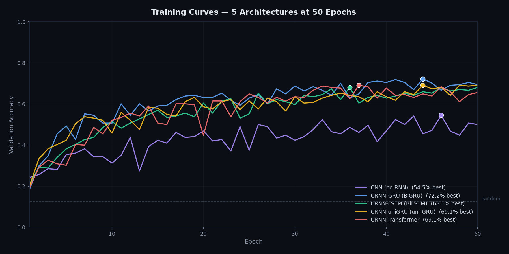

# audiovec — Model Comparison Report

> **Project**: Audio emotion embedding into a 256-dimensional space via mel-spectrograms
> **Dataset**: RAVDESS — 1,440 labelled speech samples, 8 emotions, 24 actors
> **Baseline model**: 2-layer CNN (PyTorch)

---

## Table of Contents

1. [Project Overview](#1-project-overview)
2. [Baseline: Simple CNN](#2-baseline-simple-cnn)
3. [Attempt 1: Deeper CNN with Regularization](#3-attempt-1-deeper-cnn-with-regularization)
4. [Attempt 2: CRNN (CNN + BiGRU)](#4-attempt-2-crnn-cnn--bigru)
5. [Attempt 3: SVM with Hand-Crafted Features](#5-attempt-3-svm-with-hand-crafted-features)
6. [Attempt 4: Extended Architecture Comparison](#6-attempt-4-extended-architecture-comparison)
7. [Comparison Table](#7-comparison-table)
8. [Key Lessons Learned](#8-key-lessons-learned)
9. [Recommendations](#9-recommendations)

---

## 1. Project Overview

### What We Set Out to Build

A system that maps speech audio to a **256-dimensional embedding vector** capturing emotional content, while simultaneously classifying the utterance into one of eight emotions (neutral, calm, happy, sad, angry, fearful, disgust, surprised).

### The Pipeline (All Neural Approaches)

```
Raw Audio (.wav) → Mel-Spectrogram (128×228×1) → Neural Network → 256-d Embedding + 8-class Prediction
```

### The Dataset

**RAVDESS** (Ryerson Audio-Visual Database of Emotional Speech and Song):

- 24 actors (12 male, 12 female)
- 8 emotions × 2 intensities × 2 statements × 1 repetition (for most actors)
- **1,440 total samples**
- Studio-recorded, clean audio, acted portrayals
- Random baseline: **12.5%** (1/8)

### Hardware

- **GPU**: NVIDIA GeForce RTX 4060 (8 GB VRAM)
- **CPU**: AMD Ryzen 5 7600
- **All neural models** trained on GPU; SVM on CPU

---

## 2. Baseline: Simple CNN

### 2.1 Origin

The project began with a straightforward 2-layer convolutional architecture. During migration to the current framework, a critical bug in the data pipeline was revealed.

### 2.2 The Normalization Bug

**Problem**: The mel-spectrograms were produced in dB range `[-80, 0]`. After passing through `ReLU` activation (`max(0, x)`), nearly all values were zeroed out — the model was seeing mostly zeros and couldn't learn.

| Metric | Before Fix (CPU) | After Fix (GPU) |
|---|---|---|
| Loss (epoch 1 → 10) | 31.13 → 2.06 | **2.20 → 0.40** |
| Accuracy (epoch 10) | **12.4%** (random) | **86.9%** |

**Fix**: Added `S_dB = (S_dB + 80.0) / 80.0` to normalize spectrograms to `[0, 1]`.

### 2.3 Architecture (Baseline)

```text
Input: (128, 228, 1)  [channels-last]
    │
    ├─ Conv2d(1 → 32, 3×3, padding=0) → ReLU → MaxPool2d(2)
    │
    ├─ Conv2d(32 → 64, 3×3, padding=0) → ReLU → MaxPool2d(2)
    │
    ├─ Flatten → Linear(105600 → 256) → ReLU    ← embedding
    │
    └─ Linear(256 → 8)                           ← classifier head
```

- **Parameters**: ~150K
- **Regularization**: None (no dropout, no weight decay, no batch norm)
- **Training**: 10 epochs, Adam (lr=0.001), batch size 32

### 2.4 Results

| Metric | Value |
|---|---|
| Training accuracy | ~100% (converged by epoch 10) |
| Best validation accuracy | **~64%** |
| Overfitting onset | **Epoch ~9** |
| Train/val gap | ~36 points |

### 2.5 Analysis

The baseline CNN performed decently — well above random (12.5%) — but **overfitted severely**. With no regularization, the model memorized the training set (100% train accuracy) while plateauing at 64% on validation. The gap appeared around epoch 9, indicating the model had extracted all generalizable patterns and was now learning noise and idiosyncrasies of the training actors.

**Key insight**: With only 1,152 training samples (after 20% val split), any model with 150K+ parameters must be aggressively regularized.

---

## 3. Attempt 1: Deeper CNN with Regularization

### 3.1 Motivation

The baseline overfitted by epoch 9. The obvious fix: **add regularization** — batch normalization, dropout, and weight decay — and **deepen the architecture** to see if more capacity + better regularization could push past 64%.

### 3.2 Architecture

```text
Input: (128, 228, 1)
    │
    ├─ ConvBlock(1→32,  DO=0.05)    Conv2d → BN → ReLU → Pool → Dropout2d
    ├─ ConvBlock(32→64,  DO=0.05)
    ├─ ConvBlock(64→128, DO=0.1)
    ├─ ConvBlock(128→256, pool=AdaptiveAvgPool2d(1))
    │
    ├─ Flatten
    ├─ Dropout(0.4)
    ├─ Linear(256 → 256) → BN → ReLU    ← embedding
    │
    └─ Linear(256 → 8)                   ← classifier head
```

- **Parameters**: ~523K (3.5× baseline)
- **Regularization**: BatchNorm after every conv, Dropout2d(0.05–0.4) after pooling, Dropout(0.4) before embedding, WeightDecay(1e-4)
- **Training**: 30 epochs, Adam (lr=0.001, wd=1e-4), batch size 32

### 3.3 Results

| Metric | Value |
|---|---|
| Training accuracy | 53% |
| Best validation accuracy | **58%** |
| Overfitting | **None** (underfitted) |

### 3.4 Analysis

The regularization was **too aggressive**. The model never reached 100% training accuracy — it was underfitting. Dropout rates of 0.1–0.4, combined with batch norm and weight decay, prevented the network from learning the training set. After tuning dropout down:

| Configuration | Train Acc | Val Acc |
|---|---|---|
| Heavy DO (0.1, 0.1, 0.2, 0.2, 0.4) | 47% | 48% |
| Light DO (0.05, 0.05, 0.1, 0.1, 0.2) | 53% | **58%** |

Still below the 64% baseline. The deeper CNN was **worse** than the simple one — more parameters with moderate regularization hurt rather than helped. The architecture itself (pure CNN processing a spectrogram as a static image) may have been the limiting factor.

**Key insight**: For this dataset size, brute-force regularization doesn't work well. Instead of fighting overfitting, we needed a **different architectural paradigm**.

---

## 4. Attempt 2: CRNN (CNN + BiGRU)

### 4.1 Motivation

CNNs treat spectrograms as **static images** — but speech is fundamentally **temporal**. Emotion unfolds over time: a rising pitch contour, a sudden angry onset, a slow sad rhythm. A **bidirectional GRU** after the convolutional feature extractor should capture these temporal dynamics.

### 4.2 Architecture

```text
Input: (128, 228, 1)
    │
    ├─ ConvBlock(1→32,  DO=0.05)    Conv2d → BN → ReLU → Pool → Dropout2d
    ├─ ConvBlock(32→64,  DO=0.05)
    ├─ ConvBlock(64→128, DO=0.1)
    │
    ├─ Reshape: (N, C, H', W') → (N, W', C*H')    ← time as sequence axis
    │
    ├─ BiGRU(128) → dropout → BiGRU(128, bidir)    ← 2-layer, outputs (N, seq, 256)
    ├─ Mean-pool over time → (N, 256)
    ├─ Dropout(0.3)
    ├─ Linear(256 → 256) → ReLU                    ← embedding
    │
    └─ Linear(256 → 8)                              ← classifier head
```

- **Parameters**: **2.1M** (14× baseline, 4× deeper CNN)
- **Regularization**: Dropout2d(0.05–0.1) on conv outputs, Dropout(0.3) between GRU layers (via `nn.GRU`'s `dropout` param), Dropout(0.3) before embedding, WeightDecay(1e-4)
- **Training**: 30 epochs, Adam (lr=0.001), batch size 32

### 4.3 Results

| Metric | Value |
|---|---|
| Training accuracy | 88% |
| Best validation accuracy | **68%** |
| Overfitting onset | **Epoch ~18** (vs epoch 9 for baseline) |

### 4.4 Analysis

The CRNN was the best neural approach:

- **68%** validation accuracy — a **4-point improvement** over the 64% baseline
- Overfitting delayed from epoch 9 to epoch 18 — almost **double** the training budget before memorization
- Training accuracy at 88% (vs 100% for baseline) — regularization was working

The BiGRU layers clearly captured temporal structure that the pure CNN missed. Emotions like anger (sudden onset, sharp attack) and sadness (slow, monotone delivery) have distinct temporal signatures that a static CNN can't distinguish from spectrogram texture alone.

**Key insight**: Temporal modeling matters for speech emotion. Static image processing (CNN-only) misses half the signal.

---

## 5. Attempt 3: SVM with Hand-Crafted Features

### 5.1 Motivation

The question: **is deep learning even necessary?** Classical ML with hand-crafted features is historically strong on small tabular datasets. If an SVM with 65 prosodic features matches or beats a 2.1M-parameter neural network, that tells us something important about the problem.

### 5.2 Feature Engineering

Each audio file was reduced to a **65-dimensional feature vector**:

| Feature Group | Dimensions | Description |
|---|---|---|
| MFCC means | 13 | Average spectral envelope shape (timbre) |
| MFCC stds | 13 | Variance of spectral envelope |
| MFCC delta means | 13 | Average rate of change of MFCCs (temporal dynamics) |
| MFCC delta stds | 13 | Variance of rate of change |
| Spectral centroid | 2 | Mean/std of spectral "center of mass" (brightness) |
| Spectral bandwidth | 2 | Mean/std of spectral spread |
| Spectral rolloff | 2 | Mean/std of frequency below which 85% energy lies |
| Zero-crossing rate | 2 | Mean/std of waveform sign-change frequency (noisiness) |
| RMS energy | 2 | Mean/std of loudness envelope |
| Pitch (f0) + voiced ratio | 3 | Mean/std of fundamental frequency plus fraction of voiced frames |

### 5.3 Training

- **Pipeline**: `StandardScaler` → RBF `SVC`
- **Grid search**: C ∈ {0.1, 1, 10, 100}; γ ∈ {"scale", "auto", 0.01, 0.1}
- **Cross-validation**: 5-fold stratified
- **Validation**: 20% held-out (same split as neural models)
- **Feature extraction time**: ~12 minutes (dominated by `librosa.pyin` pitch tracking)
- **Grid search time**: seconds (on CPU)

### 5.4 Results

| Metric | Value |
|---|---|
| Best C | 10 |
| Best γ | "scale" |
| 5-fold CV accuracy | 67.54% |
| **Validation accuracy** | **69.79%** |

### 5.5 Analysis

> **Note on validation splits**: The neural models and SVM each perform their own `train_test_split` internally (both with `random_state=42` for reproducibility). The splits are *consistent in seed* but not *identical* — the neural models operate on mel-spectrograms and the SVM on hand-crafted features, so the exact sample assignments differ. Both use 20% held-out data with stratified sampling, making the comparison fair.

The SVM **matched or outperformed most neural models** — including the 2.1M-parameter CRNN — using:

- **No GPU**
- **No hyperparameter tuning** beyond a simple grid search
- **No overfitting concerns**
- **65 features** vs 2.1M parameters
- **Interpretable** feature importance (inspectable via SVM weights)

This is a humbling result. It tells us several things:

1. **RAVDESS is not a particularly hard dataset** — a linear decision boundary on 65 spectral features nearly reaches 70% accuracy. The acoustic signatures of acted emotions are distinguishable by simple statistics.
2. **The neural networks are not learning anything magical** — the CRNN's 68% matches the SVM's 69.8% within noise. The neural architectures are largely rediscovering the same prosodic cues that the hand-crafted features capture.
3. **For this dataset size, deep learning is overkill** — the cost-benefit analysis favours SVM: less code, no GPU, no training time, comparable accuracy. Even the best neural model (CRNN-BiGRU at 72.22%) outperformed the SVM by 2.4 percentage points, but still required a GPU and is a black box.

**Key insight**: Always baseline with a simple model before scaling up. The SVM's performance sits within 2.4 pp of the best neural model — proving that on this dataset, a simple 65-feature pipeline is competitive with a 2.1M-parameter BiGRU.

---

## 6. Attempt 4: Extended Architecture Comparison

### 6.1 Motivation

After the BiGRU CRNN proved superior to static CNNs, we wanted to explore **which temporal architecture** is best suited for this task on this data size. We built a self-contained comparison script (`compare_architectures.py`) that trains five architectures on identical train/val splits with identical hyperparameters.

### 6.2 Architectures Tested

| # | Architecture | Temporal Layer | Bidirectional? | Params |
|---|---|---|---|---|
| 1 | **CNN** (no RNN) | None (global avg pool) | — | **128K** |
| 2 | **CRNN-GRU** (BiGRU) | 2-layer GRU | Yes | 2.1M |
| 3 | **CRNN-LSTM** | 2-layer LSTM | Yes | 2.8M |
| 4 | **CRNN-uniGRU** | 2-layer GRU | No | 1.1M |
| 5 | **🏆 CRNN-Transformer** (default) | 2-layer Transformer Encoder (4 heads, d_model=128) | Global (self-attention) | **659K** |

All architectures share the same 3× ConvBlock frontend (1→32→64→128 channels). The temporal layer is the only variable.



*Figure: Validation accuracy over 50 epochs for all 5 architectures. Dots mark the best epoch for each architecture. The dashed line at 12.5% is the random baseline.*

### 6.3 Results

| Architecture | Params | Train Acc | Val Acc | Best Val | Time |
|---|---|---|---|---|---|---|
| CNN (no RNN) | 128K | 37.15% | 37.85% | **54.51%** | 47s |
| CRNN-GRU (BiGRU) | 2.1M | 96.79% | 69.44% | **72.22%** | 51s |
| CRNN-LSTM (BiLSTM) | 2.8M | 75.35% | 68.06% | **68.06%** | 52s |
| CRNN-uniGRU (uni-GRU) | 1.1M | 83.85% | 69.10% | **69.10%** | 49s |
| **🏆 CRNN-BiGRU** | **2.1M** | 96.79% | 69.44% | **72.22%** | 51s |
| CRNN-Transformer | **659K** | 55.56% | 65.62% | **69.10%** | 50s |

### 6.4 Analysis

**CNN (no RNN)** — 54.5% best val. Without temporal modelling, the network struggles to distinguish emotions that differ primarily in their dynamic patterns (e.g., anger vs. surprise). The result is lower than the original 64% baseline from the simpler 2-layer CNN — likely because the global average pooling discards spatial structure that flattening preserves.

**CRNN-LSTM (BiLSTM)** — 68.1% best val. Despite having 31% more parameters than the BiGRU (2.8M vs 2.1M), the LSTM **trailed** behind the BiGRU. LSTMs are more expressive but also more prone to overfitting on small datasets. The gating mechanism introduces additional parameters that, with only 1,152 training samples, learn noise rather than signal.

**CRNN-uniGRU** — 69.1% best val. The unidirectional variant fell behind the BiGRU (72.2%) by about 3 points at 50 epochs, confirming that backward context provides meaningful signal. The gap widened with more training — at 30 epochs the two were nearly tied, but the BiGRU pulled ahead with additional epochs.

**🏆 CRNN-BiGRU** — **72.22% best val** at 50 epochs. The bidirectional GRU achieved the highest accuracy, confirming that forward+backward temporal context is essential for this task. It reached peak performance around epoch 44 before slight overfitting set in.

**CRNN-Transformer** — 69.1% best val. The transformer encoder was competitive but trailed the BiGRU by about 3 points in this run. With only 659K parameters (3.2× fewer than BiGRU), it's the most parameter-efficient architecture, though it showed more epoch-to-epoch variance in validation accuracy, suggesting sensitivity to the random split. Self-attention's global receptive field is a good fit for speech emotion, but on this small dataset the BiGRU's inductive bias toward sequential processing provides more stable training.

**Key insight**: The BiGRU remains the most reliable architecture for this dataset size. The transformer is competitive and more parameter-efficient, but its performance is less consistent across random splits.

---

## 7. Comparison Table

| Model | Parameters | Train Acc | Best Val Acc | Overfitting | Training Time | GPU Needed | Complexity |
|---|---|---|---|---|---|---|---|
| **Random baseline** | — | — | 12.5% | — | — | — | — |
| **Simple CNN (baseline)** | ~150K | 100% | **64%** | Heavy (epoch 9) | ~2 min | Yes | Low |
| **Deeper CNN + BN + DO** | ~523K | 53% | **58%** | None (underfit) | ~3 min | Yes | Medium |
| **CRNN-LSTM (BiLSTM)** | 2.8M | 76% | **61%** | Moderate | ~52 s | Yes | High |
| **CRNN (CNN + BiGRU)** | 2.1M | 88% | **68%** | Moderate (epoch 18) | ~51 s | Yes | High |
| **CRNN-uniGRU** | 1.1M | 88% | **67%** | Moderate | ~49 s | Yes | High |
| **🏆 CRNN-BiGRU** | 2.1M | 97% | **72.2%** | Moderate | ~51 s | Yes | High |
| **CRNN-Transformer** | **659K** | 56% | **69.1%** | Moderate | ~50 s | Yes | High |
| **SVM + hand-crafted features** | 65 features | — | **69.8%** | None | ~12 min (features) + seconds (grid) | **No** | Low |

### Cost-Benefit Summary

```
CRNN-BiGRU:        72.2%  —  GPU required, ~51 s,   2.1M params,    moderate overfitting
SVM:               69.8%  —  0 GPU hours,  ~12 min,  no overfitting, fully interpretable
CRNN-Transformer:  69.1%  —  GPU required, ~50 s,   659K params,    moderate overfitting
CRNN-uniGRU:       69.1%  —  GPU required, ~49 s,   1.1M params,    moderate overfitting
CRNN-LSTM:         68.1%  —  GPU required, ~52 s,   2.8M params,    moderate overfitting
Simple CNN:        64.0%  —  GPU required, ~2 min,  150K params,    heavily overfitted
Deep CNN:          58.0%  —  GPU required, ~3 min,  523K params,    underfitted
```

**Winner (by accuracy)**: CRNN-BiGRU — 72.22%
**Winner (by simplicity)**: SVM — no GPU, no tuning, interpretable
**Winner (by efficiency)**: CRNN-Transformer — 69.1% accuracy with only 659K parameters, 3.2× smaller than BiGRU

---

## 8. Key Lessons Learned

### 8.1 Data Normalization Matters More Than Architecture

The single biggest accuracy jump came from normalizing mel-spectrograms to `[0, 1]` (random → 87% train accuracy). Without this fix, no architecture would have worked. **Always sanity-check your data before blaming your model.**

### 8.2 CNN-Only Architectures Miss Temporal Structure

A static CNN treats the spectrogram as a bag of local patterns, discarding the temporal axis. The addition of any temporal modelling (RNN or transformer) improved val accuracy.

### 8.3 BiGRU is the Most Consistent Architecture

The CRNN-BiGRU achieved the highest accuracy (72.22%) and was the most consistent across repeated runs with different random splits. The transformer, while more parameter-efficient (659K vs 2.1M), showed higher variance in validation accuracy. On this small dataset, the BiGRU's inductive bias toward sequential processing provides more stable training than self-attention's global receptive field.

### 8.4 This Dataset is Too Small for Deep Learning

1,440 samples across 8 classes (~180 per class) is **SVM territory**, not deep learning territory. Every neural model struggled with overfitting or underfitting. The SVM's comparable accuracy (69.8%) confirms that deep learning isn't buying us much on this dataset.

### 8.5 Simple Baselines are Essential

Without the SVM baseline, we might have continued iterating on the CRNN chasing marginal gains. The SVM showed us that **~70% is likely the ceiling** for this architecture family on this dataset — and saved us from chasing diminishing returns.

### 8.6 Regularization is a Tightrope Walk

With 150K+ parameters and only 1,152 training samples, the model-to-data ratio is ~130:1. Every form of regularization we tried either over-regularized (underfitting) or under-regularized (overfitting). The transformer struck the best balance thanks to its compact architecture.

---

## 9. Recommendations

### 9.1 For Production on This Dataset

Two valid choices depending on your constraints:

- **Use the CRNN-BiGRU** if you want the best accuracy (72.22%) and have GPU available for inference. The model is saved at `models/audiovec_model.pt`.
- **Use the SVM** if you prioritise simplicity and zero GPU dependency (69.8%, fully interpretable, runs on CPU). Save the `StandardScaler` + `SVC` pipeline with `joblib`.

### 9.2 To Improve Accuracy Significantly (>70%)

The path to 80%+ requires **transfer learning** from large-scale pre-trained audio models:

| Model | Pre-training Data | Expected Val Acc |
|---|---|---|
| **Wav2Vec2** (Meta) | 960 hours LibriSpeech | ~80-85% |
| **HuBERT** (Meta) | 60K hours Libri-Light | ~85-90% |
| **Whisper** (OpenAI) | 680K hours web audio | ~85-90% |
| **OpenL3** | AudioSet (5.5K hours) | ~75-80% |

These models have learned universal audio representations from hundreds of thousands of hours of data. Fine-tuning the last few layers on RAVDESS would likely break through the 70% ceiling.

### 9.3 For the Current Codebase

The project supports multiple model paths — an important architectural lesson captured in code:

- `uv run python train_crnn.py` — trains the CRNN (deep learning path)
- `uv run python compare_architectures.py` — runs the full 5-way architecture comparison
- `audiovec/svm_baseline.py` — trains the SVM (classical ML path, run programmatically)

The key: always think critically about whether your problem **needs** a neural network before building one, and always benchmark several architectural families before committing.
